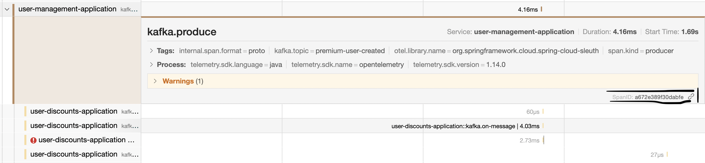
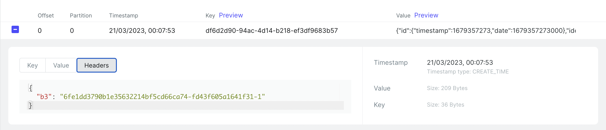

# Exercise

## Useful links:

1. [API](http://api.traceability.localhost/swagger-ui/index.html)
    1. [Insomnia Collection](./http-collections/Traceability.insomnia.json){:target="_blank" download}
    2. [Postman Collection](./http-collections/Traceability.postman_collection.json){:target="_blank" download}
2. [Jaeger](http://jaeger.traceability.localhost)
3. [Kafka UI](http://kafka.traceability.localhost)
4. [Logs](http://logs.traceability.localhost/app/discover)

## Instructions

Now, you will be able to explore Jaeger and some of the features it can bring. During the experimentation process, write down findings. (feel free to go further and explore more 💪)

!!! warning
    Don't forget to open API Documentation and Jaeger from the links above! 😅

    When it comes the time, Kafka UI and Logs also.

The exercises will be splitted into small parts:

### 1. Explore success and error logs

In this section, use Jaeger to explore failed and successful requests; which systems were involved on the request; etc.
In this section, it should only be used the Jaeger service *user-management-application*.

!!! tip
    Explore Jaeger filters to find, for example, requests with errors, specific request paths, etc.

For each request below, answer AT LEAST to the following questions:

    1. What happened in the background?
    2. How many components were involved in this request?
    3. Try to explain what each component is doing.
    4. What was the error (in case it is applicable)? 
        Where did it happen (database, before database, ...)?
    5. Fix the error in the request.
    6. Retry the list and find requests.

**Requests:**

1. Call list users endpoint
2. Call find user by id (e.g. use id = 1)
3. Create a new test user (e.g. username = test)

### 2. Explore performance issues

In this section, use Jaeger to explore performance of requests. Both Jaeger services *user-management-application* and *user-roles-application* should be used.
 

!!! tip
    Explore Jaeger filters to find requests with performance issues for each service

For each request below, answer AT LEAST to the following questions:

    1. How many components were involved in this request?
    2. Try to explain what each component is doing.
    3. Which components took more time to answer and increased the response time?
    4. What action made it increase the overall time? 
        Is it an interaction with another service? It is internal? 🤔

!!! hint
    Maybe comparing bad performance requests with better ones can give some hints on where performance leak might be.

**Requests:**

1. Create some users (in this request, you should have already found a way of calling it successfully)

    1. How fast were the requests?
    2. Did it have any spike? If so, what caused it?

1. Get default role from user-roles API

    1. Hint: make some requests to this endpoint

### 3. Deep system exploration

In this section, use Jaeger to explore the entire system. Use this section to explore as much as possible.
 
!!! tip
    Feel free to take advantage of Jaeger filters to find specific requests, requests taking too much time, services with ERRORS, etc.

For each request below, answer AT LEAST to the following questions:

    1. How many components were involved in this request?
    2. Try to explain what each component is doing.
    3. Which components took more time to answer and increased the response time?
    3. What action make it increase the overall time?
       Is it an interaction with another service? It is internal? 🤔

**Instructions:**

1. Make request to the API to create some premium users (you can use the same username for all requests 😜)

    1. What happened behind the scenes?
    2. Draw a small architecture/DAG of all services involved and how they interact with each other
    3. Find if any error is occurring in any of the services

2. Now, let's take a look at Kibana to check some logs (when opening Logs, use *fluentd* to configure the data source)

    1. Search for errors. Query: *log: "ERROR"*

    2. If any error found in the logs, check the trace id associated and search for it on Jaeger. The format should be [service-name, trace-id, parent-span-id] (e.g. [user-discounts-application,23e07778a23784e8282ccae81283effc,f5a03648ba430c17]).    

3. Now, let's find a trace with at least 1 error (different from the one found in step 2.)

    1. Open the trace

    2. Go to the span that thrown the error
    
    3. Open the parent span of the in-error span and copy its span id

    

    4. Search for the span id on the logs and analyse

As you can see, logs and tracing is closely related to each other.

## Bonus points

### Kafka

1. Open Kafka management dashboard and open the *premium-user-created* topic

    1. Open a message in the topic

    2. Check the headers. As you can see, you have a b3 header. It is the tracing propagation header.
        As it is using B3 standard, the format is <trace-id>-<parent-id>-<flag>

        

### System Architecture

1. Compare the architecture / DAG you created with the one provided by Jaeger (**System Architecture** tab on the top navbar)

### Add a new Observability Tool

1. During this workshop, Jaeger was used as observability tool. Now, try to add another tool to better understand how the OTEL Collector works.

    - *Recommended tool:* Grafana Tempo
    - Useful information for running tempo using docker compose: [Tempo docker compose](https://github.com/grafana/tempo/blob/main/example/docker-compose/local/docker-compose.yaml)

    - *Hints:*

        - *k6-tracing* and *prometheus* are not required at this point
        - *tempo* doesn't need all ports to be exposed (only tempo related - check comments)

2. Possible solution can be found here: [solution](https://github.com/josemiguelmelo/traceability-workshop/tree/grafana-tempo-integration)

### Implement a new microservice

1. Implement a new API that allows to add todos to a user. A todo can be open or closed. If the user is a premium user, there is no limit in the number of todos. Otherwise, a limit of 10 todos can be in state OPEN. 

    - In this section, explore and try out multiple approaches: HTTP request to user-management API, consume from *premium-user-created* Kafka topic, etc.

    - You can use [these projects](https://github.com/josemiguelmelo/traceability-workshop/tree/master/workshop/microservices) as reference using Spring Boot

    - If you want to try out another framework, you can also try to explore for example Quarkus with OpenTelemetry